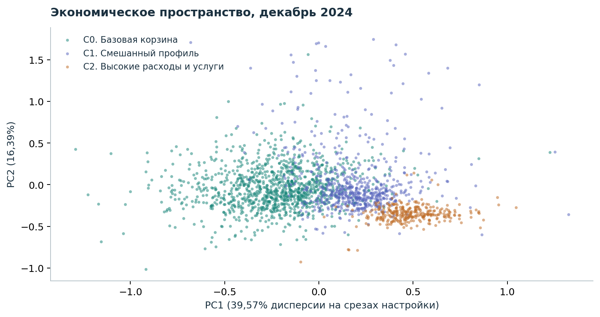
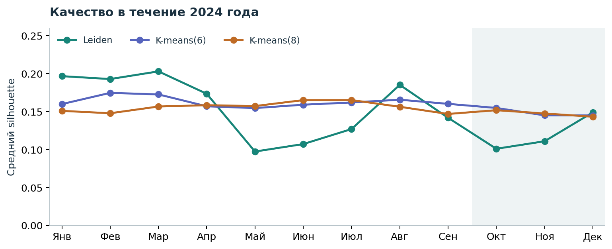
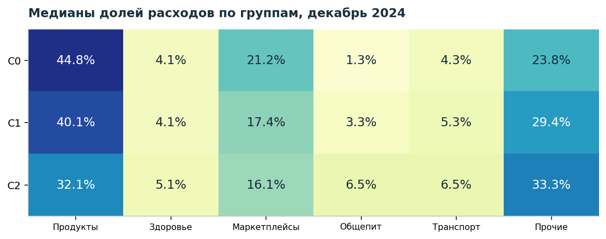
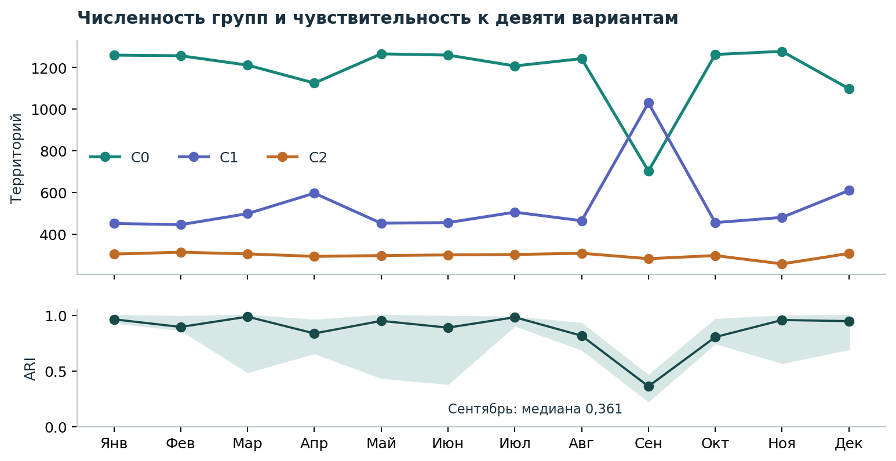
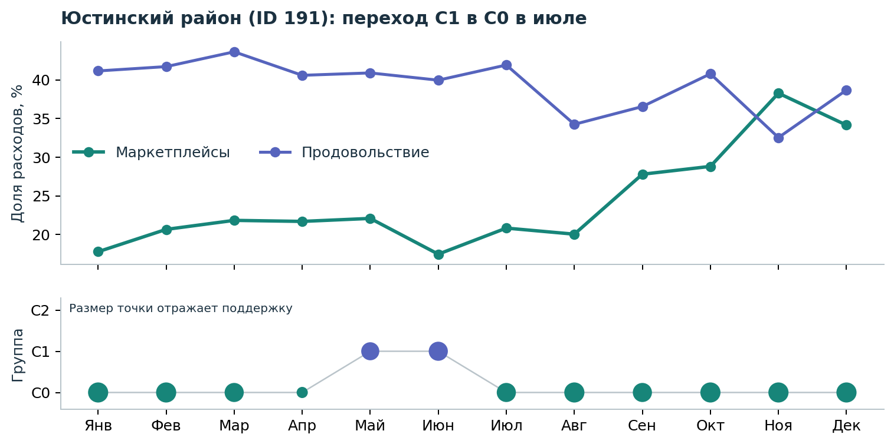
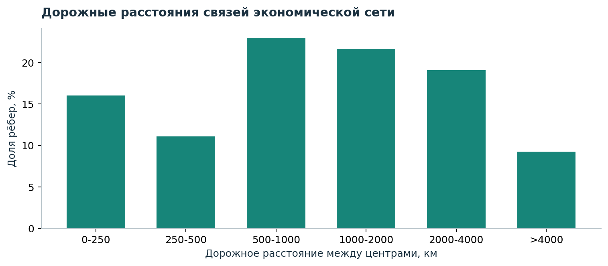

# Муниципальные траектории

Динамическая сеть сходства потребления

Конкурс исследовательских проектов СберИндекса. Номинация «Кластеризация». Данные за 2023–2024 годы. Расчёты от 4 октября 2026 года; редакция от 6 октября 2026 года.

## 1. Задача исследования

Цель работы состоит в выявлении муниципалитетов с близкими потребительскими профилями и изучении изменений этих профилей в течение 2024 года. Экономическое сходство позволяет подбирать территории для сравнения за пределами соседних районов. Анализ переходов между группами помогает выделить изменения, которые заслуживают отдельного изучения.

По полной панели из 2 016 муниципалитетов построены 12 месячных взвешенных сетей. Вершины соответствуют территориям, их атрибуты описывают расходы жителей, рёбра соединяют близкие профили. Сообщества выделены алгоритмом Leiden. Сопоставление составов групп в соседних месяцах определяет переходы территорий. Структура и уровень расходов образуют один блок признаков, годовые темпы изменения другой; оба блока имеют одинаковый масштаб вклада.

Получены три крупных профиля потребления. Из 2 653 смен меток 49 событий в 40 территориях прошли заданную проверку локальной устойчивости. Среднегодовая месячная доля маркетплейсов выросла во всех территориях панели, медианный прирост составил 4,10 процентного пункта. Около половины декабрьских связей с известным дорожным расстоянием соединяют центры, удалённые более чем на 1 000 км.

В сравнении моделей наибольшую совокупную оценку получил K-means с шестью группами. Для анализа сетевых сообществ выбрана лучшая допустимая конфигурация Leiden. Низкая разделимость групп и чувствительность отдельных месяцев ограничивают интерпретацию переходов. Результат представляет описание структуры потребления в выбранном масштабе; для установления причин изменений нужны внешние данные.

Интерактивная страница объединяет проекцию пространства признаков, карточки территорий, историю групп и список близких муниципалитетов. Расчёты, параметры моделей и помесячные результаты входят в репозиторий.

## 2. Данные и проверка качества

Использованы три файла официального муниципального набора СберИндекса: consumption.parquet, connection.parquet и market_access.parquet. Таблица потребления содержит 303 126 строк за 24 месяца и 2 190 уникальных territory_id. Полная история всех категорий доступна для 2 016 территорий, или 92,05% исходного числа. В анализ включена эта сбалансированная панель. Остальные 174 территории исключены; заполнение пропусков не проводилось. Состав панели и исключённые ID приведены в territory_coverage.csv. Различия между включёнными и исключёнными территориями требуют отдельной оценки.

Согласно описанию источника, показатель является модельной оценкой средних месячных безналичных расходов жителей в рублях. Его область измерения ограничена потребительскими расходами; он не характеризует напрямую доходы населения или оборот торговли на территории. Муниципалитеты имеют одинаковый вес. Денежные величины и темпы изменения приведены в номинальном выражении.

В исходной таблице значения хранятся в поле value, в описании набора показатель назван consumption. Код поддерживает оба варианта. Пропусков полей и повторов ключа «территория, месяц, категория» не обнаружено, все значения положительны. Показатель «Все категории» используется как знаменатель. Категория «Прочие расходы» рассчитана как разность общего показателя и суммы пяти частных категорий. Во всех наблюдениях панели остаток неотрицателен.

В таблице транспортных расстояний 5 942 364 записи. Для автодорог повторов неориентированных пар нет; для железных дорог обнаружено 1 319 314 обратных повторов. В сравнении с экономической сетью используются автодороги. Нулевые расстояния между разными ID сохранены, неизвестные расстояния учитываются как пропущенные. Набор описывает состояние на конец 2024 года и используется ретроспективно.

Индекс доступности рынков имеется для 2 004 территорий панели и отсутствует для 12. По описанию источника это нормированный показатель внешнего населения, взвешенного по дорожной удалённости. Индекс оставлен для внешнего сопоставления результатов и исключён из признаков и выбора модели. Его связь с географией учитывается при интерпретации.

Названия территорий получены по ID из вторичного публичного справочника. Все 2 016 ID сопоставились однозначно. Названия и коды ОКТМО используются для подписей и поиска; административное устройство в справочнике может отличаться от исследуемого периода. Ключом результатов служит territory_id. Постоянство границ заявлено в описании СберИндекса, независимая проверка геометрии не проводилась.

## 3. Признаки и построение сети

Профиль потребления описан семью признаками. Шесть из них представляют квадратные корни долей расходов, усреднённых за текущий и два предыдущих месяца. Такое преобразование уменьшает влияние крупных категорий. Седьмой признак равен логарифму общих расходов за вычетом медианного логарифма по территориям в том же месяце. Окно сглаживания включает только текущие и предшествующие наблюдения.

Динамику характеризуют шесть логарифмических годовых темпов: общих расходов и пяти частных категорий. Из каждого темпа вычтена его медиана по муниципалитетам текущего месяца. Центровка выделяет относительную динамику территорий на фоне общего изменения номинальных расходов. Для перехода к реальным темпам потребовались бы региональные дефляторы.

Медианы и межквартильные размахи RobustScaler оценены по январю, марту и июню 2024 года. Стандартизованные значения ограничены интервалом [-6, 6]. Каждый блок делится на квадратный корень числа своих признаков и на квадратный корень из двух. Полученное 13-мерное пространство уравнивает масштаб двух блоков. Коэффициенты преобразований сохранены в transformations.json.

Для каждого месяца найдены k ближайших соседей по евклидову расстоянию. Неориентированный граф содержит ребро, если хотя бы одна вершина выбрала другую. Вес задан формулой w(i,j) = exp(-d(i,j)/tau), где tau равна медиане положительных расстояний по выбранным направленным соседствам. Петли удалены, матрица смежности симметрична. В основной модели k = 40. Рёбра характеризуют сходство расходов жителей, без предположения о транспортных или торговых потоках между территориями.

Leiden оптимизирует RBConfigurationVertexPartition с разрешением 0,4 и начальным значением генератора 42. Месячные сети кластеризуются отдельно, межвременные рёбра и штраф за смену группы отсутствуют. Метки соседних месяцев сопоставлены венгерским алгоритмом по максимальному пересечению составов. Таблица cluster_flows.csv содержит все потоки между группами, включая расщепления и объединения.

Схема анализа ретроспективная. Коэффициенты нормировки, рассчитанные в том числе по июню, применены к ранним срезам 2024 года. Данные июля–декабря исключены из оценки этих коэффициентов и выбора конфигурации. Применение в режиме текущего мониторинга потребовало бы последовательной настройки только по информации, доступной на каждую дату.

## 4. Оценка качества и выбор модели

Сопоставлены 24 конфигурации: 18 вариантов Leiden и по три варианта K-means и Ward. Для Leiden рассмотрены три набора признаков графа, k = 20/40 и разрешение 0,4/0,8/1,2. Для K-means и Ward заданы 4, 6 и 8 групп. Атрибутивные индексы рассчитаны в общем 13-мерном пространстве. Индексы AVI, AVU и MQ для всех разбиений одного месяца используют общий опорный граф с k = 30 по объединённым признакам.

| Индекс | Предпочтение | Определение |
| --- | --- | --- |
| SW | Больше | Средний silhouette по евклидовым расстояниям |
| CH | Больше | Calinski–Harabasz в реализации sklearn |
| S_Dbw | Меньше | Рассеяние и плотность между центрами |
| AVI | Больше | Средняя доля внутреннего веса в объёме группы |
| AVU | Меньше | Средняя объединяемость групп по внешним связям |
| MQ | Больше | Взвешенная модульность Ньюмана–Гирвана, gamma = 1 |

Индексы AVI и AVU реализованы как весовая адаптация формул Shalileh, Antonov, Tsyplakova (2025). Пусть B = H' A H, H обозначает матрицу принадлежности, A симметричную взвешенную матрицу смежности. Тогда v_i = sum_j B_ij, e_i = v_i - B_ii; AVI = mean_i(B_ii/v_i); AVU = sum_{i != j}[B_ij/(e_i + e_j - B_ij)]/K. При нулевом знаменателе вклад принимается равным нулю. Модульность рассчитана как MQ = sum_i[B_ii/sum(v) - (v_i/sum(v))^2].

В S_Dbw используются популяционная дисперсия и число точек внутри заданного радиуса. Радиус равен sqrt(sum_i ||var(C_i)||)/K. При нулевой плотности в обоих центрах и положительной плотности между ними индекс принимает значение бесконечности. Такие значения сохранены в CSV и получают худший ранг. Конвенция указана явно, поскольку реализации S_Dbw могут различаться.

Совокупная оценка включает 40% среднего процентильного ранга SW, CH и обратного S_Dbw, 40% ранга AVI, обратного AVU и MQ, а также 20% ранга среднего ARI трёх дополнительных запусков в июне. К выбору допущены конфигурации с 3–12 группами и минимум 20 территориями в каждой на всех трёх срезах настройки. Веса задают принятый в работе баланс критериев. Полная таблица selection_summary.csv позволяет оценить альтернативные предпочтения.

Настройка выполнена на январе, марте и июне. Июль–сентябрь использованы для валидации, октябрь–декабрь для заключительной проверки. Февраль, апрель и май включены в описание траекторий. После настройки параметры зафиксированы. Временная зависимость соседних месяцев ограничивает независимость заключительной проверки.

## 5. Сравнение методов

K-means с шестью группами получил на срезах настройки оценку 0,784. Лучший допустимый вариант Leiden набрал 0,724. Средний ARI трёх дополнительных запусков в июне составил соответственно 0,993 и 0,757. Для изучения сообществ сети выбран этот вариант Leiden, результаты K-means используются при сравнении.

| Метод, декабрь 2024 | K | SW | CH | S_Dbw | AVI | AVU | MQ |
| --- | --- | --- | --- | --- | --- | --- | --- |
| Leiden, k40, r0,4 | 3 | 0,149 | 389,82 | 0,928 | 0,904 | 0,667 | 0,544 |
| K-means(6) | 6 | 0,145 | 332,40 | 0,736 | 0,727 | 0,489 | 0,557 |
| K-means(8) | 8 | 0,143 | 283,91 | 0,679 | 0,669 | 0,446 | 0,550 |

У Leiden выше доля внутреннего веса связей. Частично это связано с крупным размером и меньшим числом групп. Индексы реагируют на число кластеров по-разному, поэтому сравнение учитывает весь набор метрик вместе с размерами сообществ.

Средний silhouette за октябрь–декабрь равен 0,120 для Leiden, 0,148 для K-means(6) и 0,147 для K-means(8). Все три значения указывают на слабую разделимость. В декабре 16,9% территорий основной модели имеют отрицательный индивидуальный silhouette. Высокая поддержка метки при изменении параметров может сочетаться с таким результатом: воспроизводимость назначения группы и её геометрическая отделимость характеризуют разные свойства.

Ward представлен в полном сравнении на срезах настройки. Дополнительная кластеризация дорожного графа методом Leiden дала 21 группу, включая изолированные вершины. ARI между географическим разбиением и тремя экономическими группами равен 0,072 на территориях с дорожными соседями. Разное число групп ограничивает сопоставимость; результат используется для описания различий двух структур.

В random_baselines_december.csv представлены 20 случайных перестановок декабрьских меток с сохранением размеров групп. Они дают ориентир для оценки метрик относительно случайного назначения. Пространственная зависимость в перестановках не учитывается, выводы о статистической значимости по ним не делаются.

## 6. Профили потребления

Названия групп отражают медианные характеристики декабря 2024 года. Они используются для навигации по результатам. Содержательная интерпретация каждой группы опирается на её профиль в выбранном месяце; классификация благосостояния или отраслевой специализации в работе не проводится.

| Декабрь 2024 | Территорий | Медиана расходов, руб./мес. | Продукты | Маркетплейсы | Общепит |
| --- | --- | --- | --- | --- | --- |
| C0. Базовая корзина | 1 098 | 27 658,5 | 44,8% | 21,2% | 1,3% |
| C1. Смешанный профиль | 610 | 39 715 | 40,1% | 17,4% | 3,3% |
| C2. Высокие расходы и услуги | 308 | 59 604 | 32,1% | 16,1% | 6,5% |

В таблице приведены медианы индивидуальных долей внутри групп. Поскольку медианы рассчитаны по каждой категории отдельно, их сумма может отличаться от 100%. В карточке отдельной территории шесть долей образуют полную структуру расходов.

Средняя за 12 месяцев доля маркетплейсов увеличилась во всех 2 016 территориях панели. Медиана индивидуального прироста между 2023 и 2024 годами составила 4,10 п.п. Медианный номинальный прирост средних месячных общих расходов равен 15,12%. Оба результата характеризуют муниципалитеты при одинаковом весе каждой территории. Для оценки общероссийской динамики потребовалось бы взвешивание по населению.

Группа C0 сочетает более высокую долю маркетплейсов с меньшим уровнем общих расходов. Это подчёркивает значение знаменателя при сравнении долей. Переходы между группами зависят от совокупности структуры, уровня и темпов расходов; общий рост маркетплейсов описывает лишь одну часть этой динамики.

## 7. Переходы и чувствительность

Для каждого месяца рассчитаны девять альтернативных разбиений: пять начальных значений генератора, k = 30/50 и разрешение 0,36/0,44. После сопоставления групп поддержка территории определяется как доля вариантов, сохранивших её метку. Она характеризует чувствительность к заданным изменениям параметров. Статистическая вероятность правильной классификации этой процедурой не оценивается.

Переход включается в итоговый список, если новая группа сохраняется в следующем месяце, минимальная поддержка на предыдущем, текущем и следующем срезах составляет не менее 0,8, а евклидов сдвиг в 13-мерном пространстве достигает 0,5. Порог поддержки требует как минимум восьми совпадений из девяти. Порог сдвига задаёт минимальный масштаб изменения в стандартизованных признаках.

Из 2 653 смен меток 1 337 сохраняют новую группу на следующем срезе. У 205 из них достаточная поддержка, а у 49 дополнительно выполнено условие величины сдвига. Отобранные события относятся к 40 территориям. Для декабрьских смен проверка сохранения группы невозможна из-за отсутствия января 2025 года. События вне итогового списка сохранены в полной таблице переходов.

Наименьшая устойчивость наблюдается в сентябре: медианный ARI девяти вариантов равен 0,361, минимальный 0,228. Численность C0 сокращается с 1 242 территорий в августе до 703 в сентябре и возрастает до 1 262 в октябре. Такая чувствительность требует проверки массовой перегруппировки по внешним данным, прежде чем связывать её с экономическим событием.

| Минимальная поддержка | Сдвиг >= 0,25 | Сдвиг >= 0,50 | Сдвиг >= 0,75 |
| --- | --- | --- | --- |
| 0,70 | 193 | 66 | 30 |
| 0,80 | 130 | 49 | 25 |
| 0,90 | 34 | 21 | 12 |

Число отобранных событий меняется от 12 до 193 на рассмотренной сетке. Значение 49 относится к порогам 0,8 и 0,5. Выбор порогов для прикладного мониторинга потребует проверки на новых месяцах и оценки допустимого объёма ручного анализа.

## 8. Переход территории ID 191

В справочнике ID 191 соответствует Юстинскому району Республики Калмыкия. В июле 2024 года территория переходит из C1 в C0. Минимальная поддержка за июнь, июль и август составляет 8/9, сдвиг признаков равен 1,584. Группа C0 сохраняется на следующих доступных срезах. Событие удовлетворяет условиям отбора.

Доля маркетплейсов увеличилась с 17,47% в июне до 20,84% в июле, или на 3,37 п.п. Одновременно выросла доля расходов на здоровье и снизилась доля прочих расходов. Общий показатель расходов увеличился с 22 422 до 23 059 руб. Эти изменения описывают несколько составляющих перехода в многомерном пространстве.

Годовой темп общих расходов остался близким к прежнему: 17,82% в июне и 17,85% в июле. Поэтому оснований связывать смену группы с ускорением совокупных расходов нет. Июльский silhouette составляет -0,116 при высокой поддержке метки; территория расположена в области перекрытия профилей.

Для объяснения перехода могут иметь значение состав покупателей в оценке источника, сезонность расходов и локальные изменения торговых каналов. Проверить эти предположения по используемому набору невозможно: сведений об открытии пунктов выдачи, доходах домохозяйств и событиях местной экономики в нём нет.

У ID 401, Бай-Тайгинского района по тому же справочнику, переходы C1 в C0 проходят фильтр в апреле и октябре. Повторная смена показывает ограниченность временного окна проверки. Для оценки долгосрочного изменения профиля необходима более продолжительная история наблюдений.

## 9. Расстояния и доступность рынков

Декабрьская экономическая сеть содержит 61 259 неориентированных рёбер. Для 60 708 из них известно дорожное расстояние. В этой подвыборке 49,94% связей соединяют муниципальные центры, удалённые более чем на 1 000 км; медианное расстояние составляет 998 км. Рёбра с пропущенными расстояниями исключены только из данного расчёта.

Экономически близкие территории часто расположены далеко друг от друга. Файл peers_december.csv содержит для каждого муниципалитета пять ближайших профилей внутри его декабрьской группы, расстояния в пространстве признаков и дорожную удалённость. Этот список позволяет расширить географию сравнительного анализа. Применимость опыта другой территории требует отдельной содержательной оценки.

Индекс доступности рынков использован для внешнего сопоставления. Декабрьские группы объясняют 31,9% выборочной вариации log(1 + market_access) по показателю eta-squared. Медиана у 200 случайных перестановок меток равна 0,00074. Перестановки не сохраняют пространственную зависимость; расчёт имеет описательный характер, p-value не приводится.

Медианы исходного индекса в C0, C1 и C2 равны 318,2, 294,7 и 515,9 соответственно. Связь с группами немонотонна: у C1 показатель ниже, чем у C0. Ранговая корреляция доступности рынков с долей маркетплейсов в декабре составляет 0,117. Одного показателя доступности недостаточно для объяснения структуры потребления и распространения дистанционной торговли.

## 10. Применение и воспроизводимость

Результаты предназначены для сравнительного анализа муниципалитетов. Карточка территории показывает структуру расходов и историю группы; список аналогов даёт ориентиры для сопоставления; таблица переходов выделяет события для дальнейшего изучения. В практической работе каждое событие может сопоставляться с независимыми источниками и местной статистикой. Экономический эффект применения инструмента пока не измерялся.

Автономная страница site/index.html содержит выбор месяца, поиск территории, фильтры группы и поддержки, проекцию PCA, профиль расходов и список переходов. Координатная система PCA оценена на срезах настройки и зафиксирована во времени. Две оси сохраняют 55,96% дисперсии обучающего пространства. При оценке близости территорий приоритет имеет исходное 13-мерное расстояние.

Расчёт запускается по JSON-конфигурации. Исходные данные включены с лицензией и контрольными суммами. Девять тестов проверяют формулы метрик на малых графах, симметрию сети, обработку неизвестных расстояний, сопоставление меток, сохранение расщеплений и отсутствие влияния последних трёх месяцев на более ранние признаки. Повторные запуски в одной программной среде совпали по девяти таблицам и семи массивам при rtol = 1e-10 и atol = 1e-12. Время выполнения исключено из сравнения.

Область применения ограничена покрытием исходного набора, отсутствием весов населения и региональных дефляторов, слабой разделимостью групп и чувствительностью к параметрам. Вторичный справочник названий требует проверки при переходе к конкретной территории. Независимая разметка и данные для установления причин изменений отсутствуют.

Развитие исследования предполагает сопоставление с официальными показателями при согласованных границах, сравнение экономического и географического разбиений при одинаковом числе групп, оценку устойчивости на новых месяцах и ручную проверку событий. Отдельный вопрос связан с временной регуляризацией: насколько она уменьшит нестабильность и какие наблюдаемые переходы при этом сгладит.

Исходные и производные данные распространяются по CC BY-SA 4.0, код проекта по MIT. Полный перечень источников приведён в SOURCES.md. Выводы относятся к потреблению за 2023–2024 годы.
